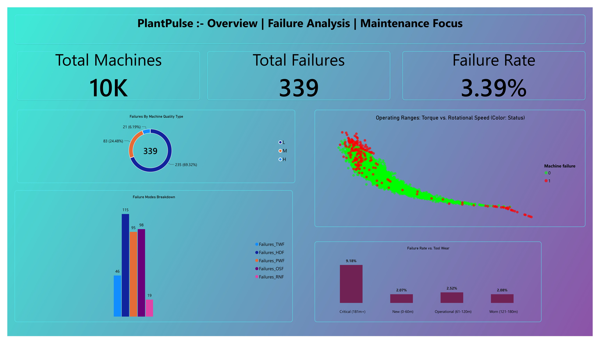
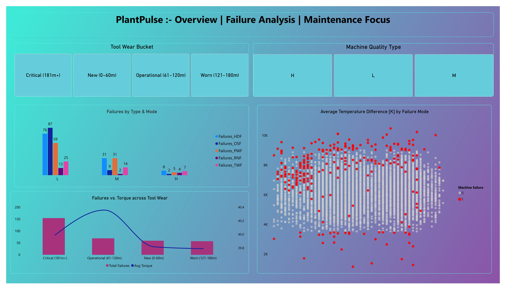
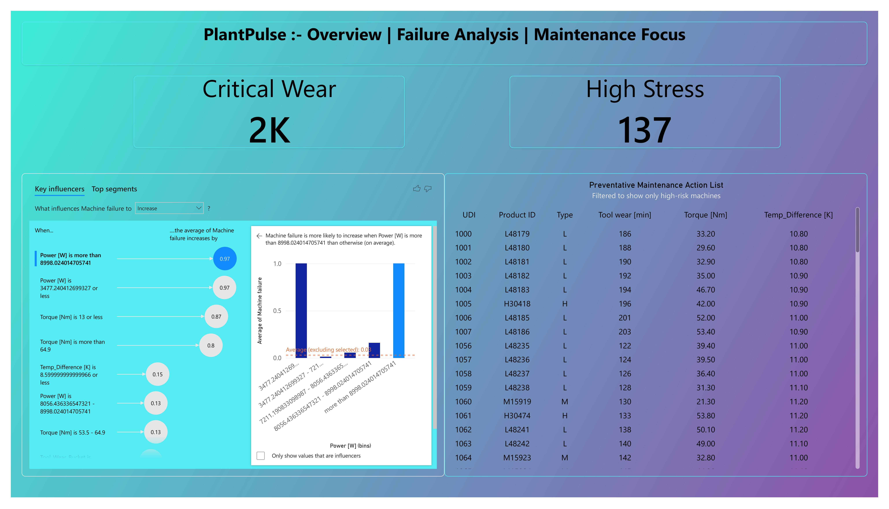

# PlantPulse: Manufacturing Reliability & Maintenance Analytics

> **Domain:** Industrial Operations & Predictive Maintenance

> **Tech Stack:** Python (Pandas, SciPy, Statsmodels), Power BI

> **Focus:** Physics-based Feature Engineering, Statistical Hypothesis Testing, Actionable BI Design

## Executive Summary

A manufacturing plant wants to reduce unexpected equipment downtime. This project analyzes industrial machine operation data to identify the specific operating conditions and physical boundaries that trigger catastrophic failures. Moving beyond basic exploratory analysis, this project employs rigorous statistical testing to validate failure patterns before translating them into an interactive Power BI monitoring tool used to dispatch preventative maintenance teams.

*Note on Data Source: This project utilizes the **AI4I 2020 Predictive Maintenance Dataset** from the UCI Machine Learning Repository. UCI explicitly designates this as a synthetic dataset engineered to accurately reflect real-world predictive maintenance conditions, including inherent anomalies and unknown failure modes.*

## Dashboard preview


*Overview*


*Failure Analysis*


*Maintenance Focous*

##  Business Problem & Key Questions

Operations leadership requires a data-driven approach to preventative maintenance, asking:

* What operating conditions (torque, rotational speed, temperature) are associated with machine failures?
* Which specific failure modes (Tool Wear, Heat Dissipation, Overstrain) dominate our downtime?
* Are specific machine quality tiers (Low, Medium, High) more susceptible to failure?
* **Actionable Output:** Which specific machines currently operating on the floor should be flagged for immediate preventative inspection?

##  Repository Architecture

The project follows modular software engineering best practices, separating raw data, transformation logic, and exploratory notebooks.

```text
PlantPulse/
├── data/
│   ├── 01_raw/             # Immutable UCI dataset
│   ├── 02_interim/         # Validated data post-anomaly checking
│   └── 03_processed/       # Final engineered dataset for Power BI
├── notebooks/              
│   ├── 01_data_validation.ipynb       # Data integrity and anomaly checks
│   ├── 02_feature_engineering.ipynb   # Physics-based feature creation execution
│   └── 03_eda_and_statistics.ipynb    # Hypothesis testing and threshold discovery
├── src/                    
│   ├── config.py           # Centralized path and schema constants
│   ├── data_processing.py  # Modular transformation pipelines (DRY code)
│   └── stats_helpers.py    # Reusable T-Test and Chi-Square functions
├── dashboard/              
│   └── PlantPulse.pbix     # Interactive Power BI dashboard
|   └── screenshots/        # Power BI dashboard preview
├── requirements.txt
└── README.md

```

##  Analytical Workflow

### 1. Data Validation & Anomaly Detection

Prior to modeling, the raw sensor data underwent rigorous physical boundary validation. This phase successfully identified "phantom failures"—a known anomaly where the master failure flag triggers despite all specific failure mode sensors registering zero, reflecting real-world diagnostic blind spots.

### 2. Physics-Based Feature Engineering

Raw sensor readings were transformed into meaningful physical KPIs using custom Python modules (`src/data_processing.py`):

* **Mechanical Power [W]:** Engineered from raw Torque and Rotational Speed to measure total physical load.
* **Heat Dissipation Capability [K]:** Calculated via the differential between Process Temperature and Ambient Air Temperature.
* **Tool Wear Categorization:** Continuous runtime data bucketed into lifecycle stages (New, Operational, Worn, Critical) for operational slicing.

### 3. Statistical Proof

Rather than relying solely on visual correlation, relationships were subjected to statistical hypothesis testing (`src/stats_helpers.py`):

* **Welch's T-Tests** confirmed that failures occur at statistically significant extreme boundaries (e.g., proving Overstrain Failure is definitively linked to torque anomalies, p < 0.05).
* **Chi-Square Tests of Independence** validated the relationship between machine manufacturing quality (L, M, H) and overall failure susceptibility.

##  Key Insights & Business Impact
By analyzing the physical constraints and statistical failure boundaries, this project delivered the following actionable solutions for the operations team:

* **Heat Dissipation Limits (HDF):** Statistical testing proved that Heat Dissipation Failures are highly probable when the temperature differential (Process Temp - Air Temp) drops below 8.6 K. 
  * *Solution:* Programmed a risk flag in Power BI to alert maintenance when machines enter this thermal danger zone, allowing for cooling system inspections before catastrophic failure.
* **Overstrain & Torque Boundaries (OSF):** Overstrain Failures are not random; they cluster heavily when rotational torque exceeds 60 Nm combined with low rotational speed. 
  * *Solution:* Operations leadership can use these exact thresholds to implement hard physical load limits on the manufacturing floor.
* **Predictive Tool Replacement (TWF):** Tool Wear Failures scale non-linearly. The data revealed a massive spike in failures once a tool enters the "Critical" bucket (181+ minutes of runtime).
  * *Solution:* The dashboard automatically filters the daily maintenance action list to prioritize machines approaching the 180-minute runtime threshold for preventative tool replacement.
* **Quality Tier Resource Allocation:** Type 'L' (Low quality) machines account for over 60% of all failures despite making up only 50% of the plant's volume. 
  * *Solution:* Maintenance routes can be optimized to check Type 'L' machines twice as frequently as Type 'H' (High quality) machines, optimizing labor hours.

##  Power BI Dashboard: From Insight to Action

The final deliverable is a 3-page Power BI dashboard designed for floor managers.

1. **Plant Overview:** A high-level executive summary tracking total active machines, the current failure rate (3.39%), and a scatter plot defining the physical safety envelope of operations.
2. **Failure Analysis:** An interactive diagnostic page allowing managers to slice failure modes by machine lifecycle (tool wear) and quality tier. Highlights the exact temperature and power thresholds that trigger specific failures (e.g., Heat Dissipation Failure occurring < 8.5K Temp Difference).
3. **Maintenance Focus:** The operational action center. Utilizes DAX risk flags and native AI Key Influencers to instantly generate a filtered **Preventative Maintenance Action List**—identifying specific, high-risk machines (`UDI`s) for mechanics to inspect today.

##  How to Reproduce

1. Clone the repository.
2. Install dependencies: `pip install -r requirements.txt`
3. Run the notebooks in the `notebooks/` directory sequentially. The `src/` modules will handle the data transformations automatically based on `config.py` paths.
4. Open `dashboard/PlantPulse.pbix` in Power BI Desktop and refresh the data source to point to your local `data/03_processed/plantpulse_processed.csv`.